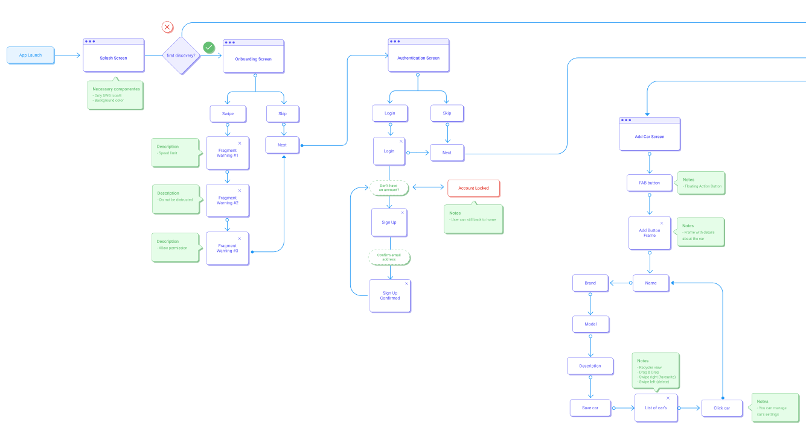

# Strada
Project for Google Play
Проект предназначен для показа навыков в Android разработке. 
В работе используются многопоточность через corutines, работа с сетью Retrofit, для показа новостей.
Room, как локальная база данных. Сервис, для отслеживания и показа скорости. Firebase.

# User Flow Diagram

