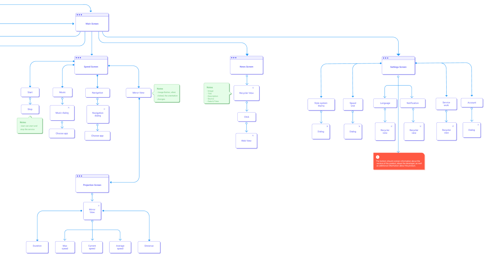
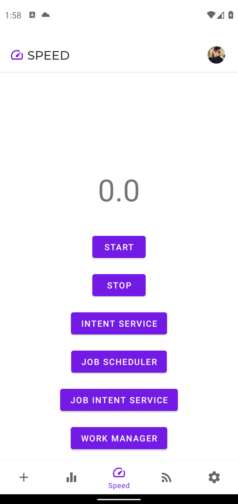

# Strada

Project for Google Play

1. Начало разработки
    1. [User Flow Diagram](#User-Flow-Diagram)
    2. Wireframes
    3. Протипирование
2. Экраны и их описание
    1. [Splash Screen](#Splash-Screen)
    2. [OnBoarding](#OnBoarding-Screen)
    3. [Auth Screen](#Auth-Screen)
    4. [Add Screen](#Add-Screen)
    5. [Equalizer Screen](#Equalizer-Screen)
    6. [Speed Screen](#Speed-Screen)
    7. [News Screen](#News-Screen)
    8. [Settings Screen](#Settings-Screen)
3. Дополнительная информация
    1. Dagger
    2. Coroutines
    3. Firebase
    4. Services
4. Заключение

## User Flow Diagram

###### На данной диаграмме показано взаимодейсвтия пользователя с ознокомительным экраном и регистрацией,а также фрагментом добавления автомобиля

###### На данной диаграмме показано взаимодейсвтия пользователя с эквалайзером и настроек громкости звука, а также взаимодействия с глобальным выбором настроек

###### На данной диаграмме показано взаимодейсвтия пользователя с сервисом по опредленюю скорости, выбором приложений, с Mirror фрагментом (экран для проекции), с настройками приложения и RSS новостями

## Splash Screen

###### Загрузочный экран

## OnBoarding Screen

###### Экран с введением на тему безопасности, а также для подтверждения запрашиваемых разрешений

    

## Auth Screen

###### Экран с авторизацией

## Add Screen

###### Экран с просмотром и добавлением автомобилей (В разработке)

   

## Equalizer Screen

###### Экран с добавление профилей для машины (В разработке)

## Speed Screen

###### Экран с запуском серивиса  (В разработке)

## News Screen

###### Экран с просмотром новостей

  

## Settings Screen

###### Экран с изменением настроек (В разработке)

